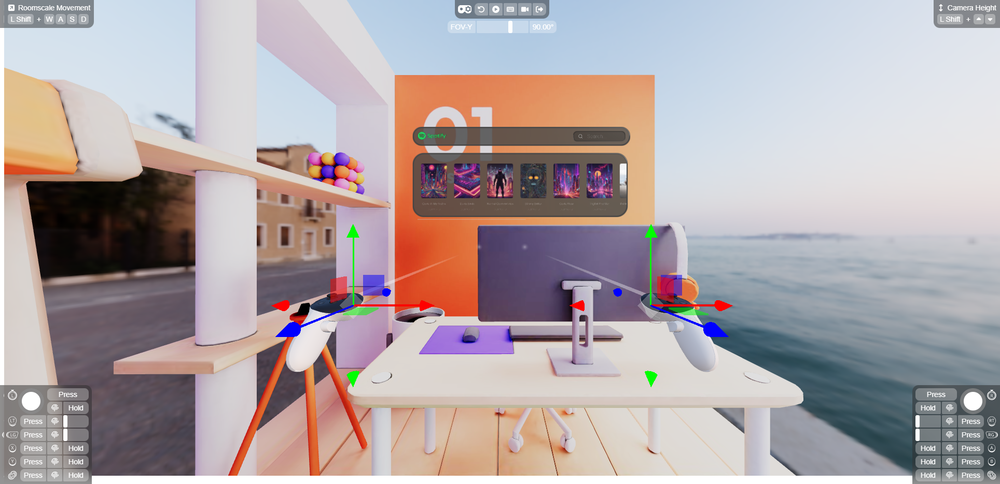

# SpatialJS Music Room Tutorial

<p align="center">
  
</p>

<h3 align="center">Create an interactive spatial room with a wall-jumping music player</h3>

<br/>

Built with ❤️ by [Deamoner](https://twitter.com/spatialmatty) | [Personal Site](https://mattydavis.ca/) | [YouTube](https://www.youtube.com/@mattjdavis) | [Medium](https://medium.com/@mdavis-71283) | [Discord](https://discord.gg/tKNwtpDVJn)

## Live Demo

You can try out this project live on CodeSandbox:

[](https://codesandbox.io/p/github/Deamoner/spatialjs-room-example/main?import=true)

This live demo allows you to explore the interactive spatial room with the wall-jumping music player directly in your browser.

## Base Libraries

This project is built using the following:

- [SpatialJS](https://github.com/Deamoner/spatialjs) - A framework for building spatial user interfaces
- [@spatialjs/core](https://www.npmjs.com/package/@spatialjs/core) - Core package for SpatialJS
- [SpatialJS Documentation](https://spatialjs.dev/) - Official documentation and guides

These libraries provide the foundation for creating interactive 3D spatial environments with React and Three.js.

## Getting Started

1. Clone this repository
2. Install dependencies:

```bash
npm install
```

3. Run the development server:

```bash
npm run dev
```

Now you should be able to run the completed project without issue.
Let's look at how we did it.

## Project Build

This project uses Vite as the build tool. Here's how to set up the basic structure:

1. Initialize a new Vite project with React and TypeScript:

```bash
npm create vite@latest spatialjs-room-example -- --template react-ts
```

2. Install Dependencies:

```bash
npm install @react-three/fiber @react-three/drei @react-three/xr @react-three/uikit @spatialjs/core three
```

3. Setup your Basic App with a Canvas, OrbitControls, and XR:

```typescript:src/App.tsx
import { Canvas } from '@react-three/fiber';
import { OrbitControls, Preload, useGLTF } from '@react-three/drei';
import { XR } from '@react-three/xr';
import { WindowManager, createWindow, useWindowStore } from '@spatialjs/core';

const store = createXRStore({
  emulate: true,
  frameRate: 'high',
  foveation: 100,
});

const App: React.FC = () => {
  return (
    <Canvas>
      <XR store={store}>
        <OrbitControls />
      </XR>
    </Canvas>
  );
};
```

4. Setup your Basic Room with an environment and room mesh:
<p align="center">
  
</p>

```typescript:src/components/Room.tsx
import { useThree } from '@react-three/fiber'
import { useGLTF } from '@react-three/drei'
import { useEffect, useState, useCallback } from 'react'
import * as THREE from 'three'
import { useWindowStore } from '@spatialjs/core';

export function Room() {
    const { nodes } = useGLTF('/level-react-draco.glb');
    const [position, setPosition] = useState([0, -0.45, 0])
     return (
    <mesh
      key="room"
      scale={4.5}
      geometry={nodes.Level.geometry}
      material={nodes.Level.material}
      position={[position[0] - 1.75, -position[1], -position[2]]}
      rotation={[Math.PI / 2, -Math.PI / 9, 0]}
      onClick={handleClick}
      pointerEventsType={{ deny: ["grab", "touch"] }}
    />
  )
}
```

5. Create the Music Player Windows and UI:

```typescript:src/components/MusicPlayer.tsx
import React, { useRef, useState } from 'react';
import { Container, Image } from '@react-three/uikit';
import { Input } from './apfel/input'
import { Album, albums } from './Albums';
import { Card } from './apfel/card';
import { AlbumArtwork } from './Album';
import { colors } from '../theme';
import { Search } from '@react-three/uikit-lucide';
import { useAlbumStore } from '../useAlbumStore';
import { createWindow } from '@spatialjs/core';
import MusicPlayerWindow from './MusicPlayerWindow';

const MusicPlayer: React.FC = () => {
    const abumConRef = useRef<any>(null);
    const [text, setText] = useState('')
    const setCurrentAlbum = useAlbumStore((state) => state.setCurrentAlbum);
    const selectAlbum = (album: Album) => {

        createWindow(MusicPlayerWindow, {
            id: 'music-player',
            title: album.name,
            width: 100,
            height: 100,
            followCamera: false
        });
        setCurrentAlbum(album);
    };


    return (
        <>
            <Card positionType="absolute" width="95%" height={55} padding={10}>
                <Image src="Spotify.png" width={100} height={60} objectFit="cover" />
                <Container width="100%" height="100%" justifyContent="flex-end" alignItems="center">
                    <Input width={150} height={30} value={text} onValueChange={setText} placeholder="Search..." prefix={<Search />} />
                </Container>
            </Card>
            <Card marginTop={75} paddingLeft={10} width="100%" height={185} justifyContent="center" flexDirection="column">

                <Container paddingBottom={12} scrollbarOpacity={0.5} scrollbarWidth={2} scrollbarColor={colors.mutedForeground} ref={abumConRef} width={600} height={200} alignItems="auto" justifyContent="flex-start" flexDirection="row" overflow="scroll" >
                    {albums.map((album) => (
                        <AlbumArtwork key={album.name} album={album} width={100} height={100} onClick={(e) => {
                            e.stopPropagation()
                            selectAlbum(album)
                        }} />
                    ))}
                </Container>
            </Card>
        </>
    );
};
export default MusicPlayer;
```

```typescript:src/components/MusicPlayerWindow.tsx
import React from 'react';
import MusicPlayer from './MusicPlayer';
import AlbumWindow from './AlbumWindow';
import { useAlbumStore } from '../useAlbumStore';

export const MusicPlayerWindow: React.FC = () => {
  const currentAlbum = useAlbumStore((state) => state.currentAlbum);

  return (
    <>
      <AlbumWindow album={currentAlbum!} />
    </>
  );
};

export default MusicPlayerWindow;

```

Create the album playing store and the music player window:

```typescript:src/useAlbumStore.ts
import create from 'zustand';
import { Album } from './components/Albums';

interface AlbumStore {
  currentAlbum: Album | null;
  setCurrentAlbum: (album: Album) => void;
}

export const useAlbumStore = create<AlbumStore>((set) => ({
  currentAlbum: null,
  setCurrentAlbum: (album) => set({ currentAlbum: album }),
}));

```

6. Now add the window when the app starts, add the following to the App.tsx file:

```typescript:src/App.tsx
useEffect(() => {
    createWindow(<MusicPlayer />, {
        id: 'music-player',
        title: 'Music Player',
        width: 100,
        height: 100,
        followCamera: false
    });
}, []);
```

7. For interactions to allow the players to move around the room add the following to the Room Mesh:

```typescript:src/components/Room.tsx
const [position, setPosition] = useState([0, -0.45, 0])
  const { setPosition: setWindowPosition, setRotation: setWindowRotation, lastWindow } = useWindowStore();

  const handleClick = useCallback((event: any) => {
    event.stopPropagation()
    console.log(event);
    // Calculate surface normal at the click point
    const face = event.face
    const normal = face.normal.clone()
    normal.transformDirection(event.object.matrixWorld)

    // Calculate a point slightly in front of the clicked point along the surface normal
    const offsetDistance = 0.1 // Adjust this value as needed
    const offsetPoint = event.point.clone().add(normal.multiplyScalar(offsetDistance))

    // Calculate rotation to face outward from the surface
    const rotationMatrix = new THREE.Matrix4().lookAt(normal, new THREE.Vector3(0, 0, 0), new THREE.Vector3(0, 1, 0))
    const rotation = new THREE.Euler().setFromRotationMatrix(rotationMatrix)

    console.log('Room clicked!', offsetPoint)
    if (lastWindow) {
      setWindowPosition(lastWindow, offsetPoint)
      setWindowRotation(lastWindow, rotation)
      useWindowStore.getState().updateWindow(lastWindow, {
        disableTiling: true,
        position: offsetPoint,
        rotation: rotation
      });
    }
  }, [setWindowPosition, setWindowRotation, lastWindow])
```

## Support

For questions, bug reports, or feature requests, please open an issue on our [GitHub repository](https://github.com/Deamoner/spatialjs).

---

Built with ❤️ by [Deamoner](https://twitter.com/spatialmatty) | [Personal Site](https://mattydavis.ca/) | [YouTube](https://www.youtube.com/@mattjdavis) | [Medium](https://medium.com/@mdavis-71283) | [Discord](https://discord.gg/tKNwtpDVJn)
